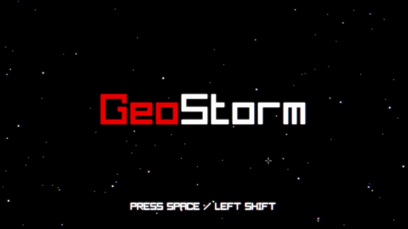

# Geostorm

### General Information

This project was done for the ISART Digital school by Rémi Serra. <br>
The goal was to create a space shooter in C# using the Raylib library.

<br>

## Preview




<br>

## Features

### Gameplay
- Move using ```WASD```
- Dash using ```Space``` or ```Left Shift```
- Aim using the mouse
- Shoot using ```Left Click```
- The player earns score by killing enemies
- Defeated enemies drop shards that increment the player's score multiplier when picked up
- The player's weapon upgrades when their score multiplier is high enough
- When the player is touched by an enemy, their score multiplier is reset and they are temporarily invincible

### Enemies
- Wanderers
    - Purple spinning spaceships
    - They move around randomly and bounce on screen edges
- Rockets
    - Orange arrow-shaped spaceships 
    - They move in one direction and turn around when they hit the screen edges
- Grunts
    - Blue diamond-shaped spaceships
    - They move towards the player in a straight line
- Weavers
    - Green square-shaped spaceships
    - They move towards the player and doge bullets
- Snakes
    - Spaceships with a purple pointy head and yellow tail parts
    - They move around randomly and bounce on the screen edges
    - They can be killed only by a bullet to the head

### Visual
- Particles
- Stars scrolling in the background
- Post processing:
    - Bloom
    - Chromatic aberration
    
### Debug menu
- Press ```Left Alt + D``` to show the debug menu
- This menu shows:
    - The current amount of frames per second
    - The current duration of each frame (delta time)
    - The total number of entities
    - The number of bullets
    - The number of enemies
    - The number of particles

### Cheats menu
- Press ```Left Alt + C``` to show the cheats menu
- Player cheats:
    - Add health
    - Change dash or invincibility durations
- Weapon cheats:
    - Change weapon stats
    - Set weapon stats using presets
- Enemy cheats:
    - Disable adaptative wave interval
    - Change time interval between enemy waves
    - Kill all enemies
    - Snake enemy maximum and minimum size
    - Enemy spawning probabilities
- Cosmetic settings:
    - Number of stars
    - Number of particles per enemy killed

<br>

## Build and run

```
Visual Studio > Release Any CPU > Run
```
